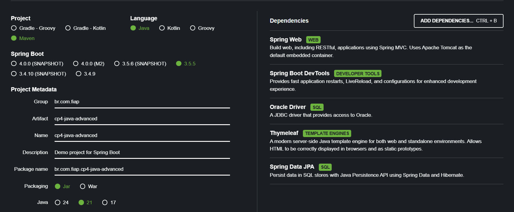
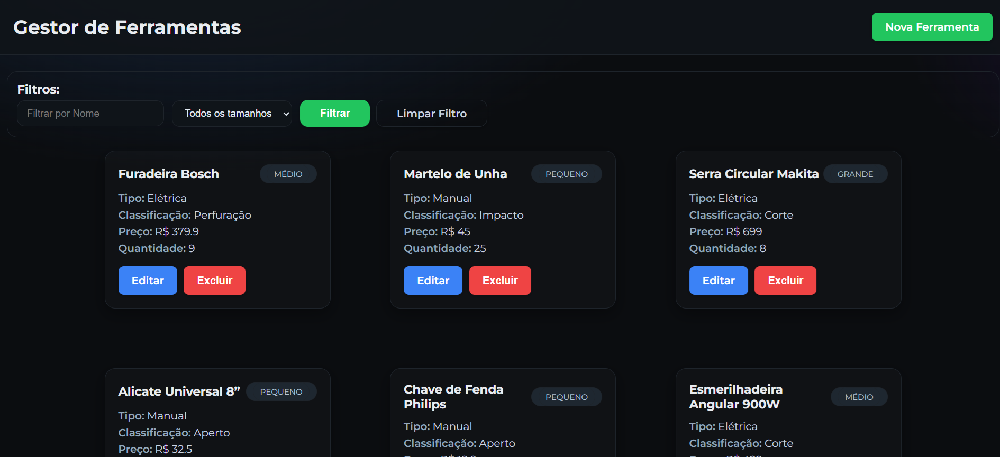
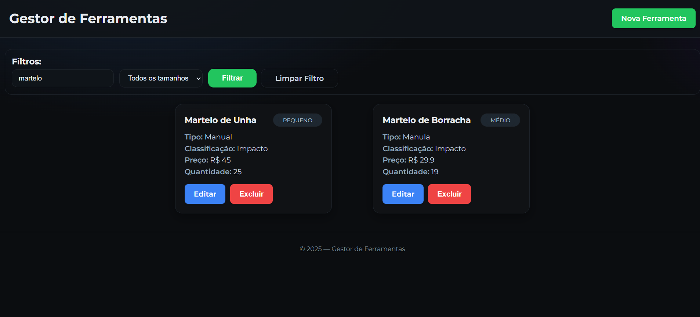
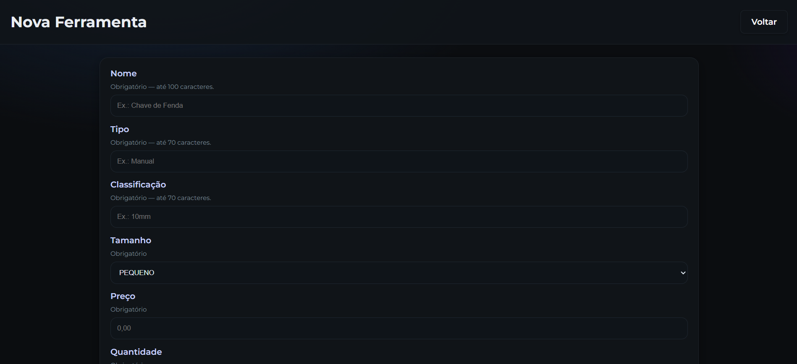
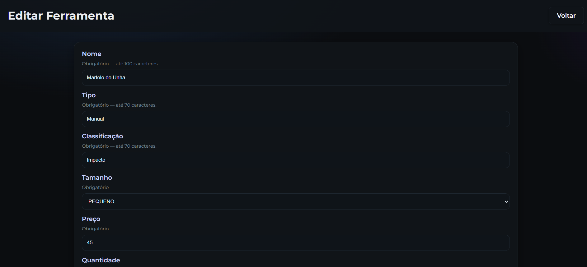
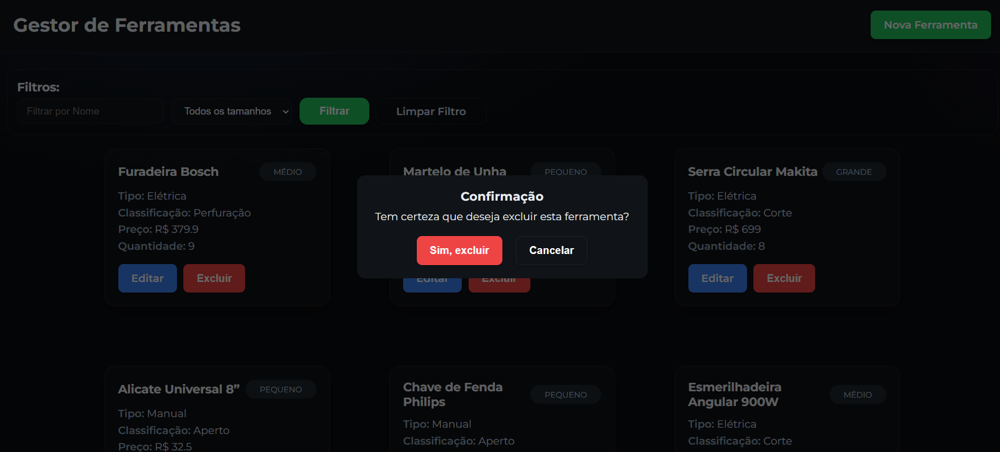

# 🛠️ MVC de Ferramentas

---

## 📑 Sumário

- [👥 Integrantes do Grupo](#-integrantes-do-grupo)
- [🛠️ Tecnologias Utilizadas](#-tecnologias-utilizadas)
- [📖 Descrição do Projeto](#-descrição-do-projeto)
- [📂 Estrutura do Projeto](#-estrutura-do-projeto)
- [⚙️ Configuração do Spring Initializr](#-configuração-do-spring-initializr)
- [🚀 Como Rodar a Aplicação](#-como-rodar-a-aplicação)
- [🧱 Estrutura da Entidade Ferramenta](#-estrutura-da-entidade-ferramenta)
- [📡 Funcionalidades e URLs](#-funcionalidades-e-urls)
- [🌐 Deploy da API](#-deploy-da-api)

---

## 👥 Integrantes do Grupo
- 👨‍💻 **Felipe Ulson Sora** – RM555462 – [@felipesora](https://github.com/felipesora)
- 👨‍💻 **Augusto Lope Lyra** – RM558209 – [@lopeslyra10](https://github.com/lopeslyra10)
- 👨‍💻 **Vinicius Ribeiro Nery Costa** – RM559165 – [@ViniciusRibeiroNery](https://github.com/ViniciusRibeiroNery)

---

## 🛠️ Tecnologias Utilizadas
- Java 21
- Spring Boot 3.5.4
- Maven
- Banco de dados Oracle
- JPA (Hibernate)
- Spring MVC com Thymeleaf

---

## 📖 Descrição do Projeto

Este projeto é um sistema web MVC de gerenciamento de ferramentas, desenvolvido para a CP4 da disciplina de Java Advanced na faculdade.
Ele permite cadastrar, listar, atualizar e excluir ferramentas através de páginas HTML, proporcionando uma interface amigável para o usuário.
O foco principal foi praticar conceitos de **Spring MVC**, **Thymeleaf** e **manipulação de dados com JPA e Oracle**.

---

## 📂 Estrutura do Projeto

```
src
└── main
    └── java
        └── com
            └── cp4_java_advanced
                ├── controller
                ├── model
                ├── repository
                └── service
└── resources
    └── static
        ├── css # arquivos .css
        └── js  # arquivos .js
    ├── templates   # arquivos Thymeleaf (.html)
    └── application.properties
```

- 🕹️ **controller**: gerencia requisições HTTP e retorna páginas HTML com os dados do modelo.
- 🧱 **model**: representa as entidades do banco de dados.
- 🗃️ **repository**: interfaces JPA que fazem a comunicação com o banco.
- 🔧 **service**: contém a lógica de negócio da aplicação.
- 📄 **templates**: arquivos Thymeleaf que representam as páginas da aplicação (lista, cadastro, edição).

---

## ⚙️ Configuração do Spring Initializr

Para iniciar o projeto, utilizamos o [Spring Initializr](https://start.spring.io/), configurando as dependências básicas necessárias para o projeto.  

Segue uma captura de tela (print) da configuração utilizada:



### Dependências selecionadas:
- Spring Web
- Spring Boot DevTools (opcional para desenvolvimento)
- Oracle Driver
- Thymeleaf
- Spring Data JPA

---

## 🚀 Como Rodar a Aplicação

1. Clone este repositório:

```bash
   git clone https://github.com/felipesora/cp4-java-advanced-parte-2.git
```
2. Configure o banco Oracle e atualize as credenciais no arquivo `application.properties` (ou `application.yml`).
3. Abra o projeto na sua IDE favorita (IntelliJ, Eclipse).
4. Execute a classe principal que inicializa o Spring Boot.
5. Use o Postman ou qualquer cliente HTTP para testar os endpoints.

---

# 🧱 Estrutura da Entidade Ferramenta

A classe `Ferramenta` representa a entidade principal do sistema, mapeada para a tabela `TDS_TB_Ferramentas` no banco de dados Oracle.

| Atributo        | Tipo           | Descrição                                            | Observações                                         |
|-----------------|----------------|------------------------------------------------------|-----------------------------------------------------|
| `id`            | Long           | Identificador único da ferramenta                    | Chave primária, gerada automaticamente (`IDENTITY`) |
| `nome`          | String         | Nome da ferramenta                                   | Obrigatório, máximo 100 caracteres                  |
| `tipo`          | String         | Tipo da ferramenta                                   | Obrigatório, máximo 70 caracteres                   |
| `classificacao` | String         | Classificação da ferramenta                          | Obrigatório, máximo 70 caracteres                   |
| `tamanho`       | Enum `Tamanho` | Tamanho da ferramenta (`PEQUENO`, `MEDIO`, `GRANDE`) | Armazenado como string, obrigatório                 |
| `preco`         | BigDecimal     | Preço da ferramenta                                  | Precisão 10,2 casas decimais                        |
| `quantidade`    | Integer        | Quantidade disponível                                | Obrigatório, até 10 dígitos                         |

---

# 📡 Funcionalidades e URLs

1. **Listar ferramentas**

- **URL:** `/ferramentas`
- **Descrição:** Mostra a lista completa de ferramentas cadastradas.



---

2. **Filtrar ferramentas por nome ou tamanho**

- **URL:** `/ferramentas?nome=&tamanho=`
- **Descrição:**  Lista ferramentas filtradas pelo nome e/ou tamanho.



---

3. **Cadastrar nova ferramenta**

- **URL:** `/ferramentas/cadastrar`
- **Descrição:**  Página para cadastrar uma nova ferramenta.



---

4. **Editar ferramenta**

- **URL:** `/ferramentas/editar/{id}`
- **Descrição:**  Página para atualizar os dados de uma ferramenta existente.



---

5. **Deletar ferramenta**

- **URL:** `/ferramentas/deletar/{id}`
- **Descrição:**  Remove a ferramenta e redireciona para a lista.



---

## 🌐 Deploy da API

O projeto está publicado e disponível para acesso no Render.  
Confira o projeto funcionando no link abaixo:  

🔗 [Acessar API no Render](https://cp4-java-advanced-parte-2.onrender.com/ferramentas)

>**Nota:** A URL base é `https://cp4-java-advanced-parte-2.onrender.com`
Por exemplo, para acessar a página principal, acesse:
`https://cp4-java-advanced-parte-2.onrender.com/ferramentas`

---

## 📹 Demonstração em Vídeo

Gravamos um vídeo de demonstração do sistema em funcionamento, mostrando as principais funcionalidades:  
🔗 [Assistir no YouTube](https://www.youtube.com/watch?v=ICUOo5QImGo)

---