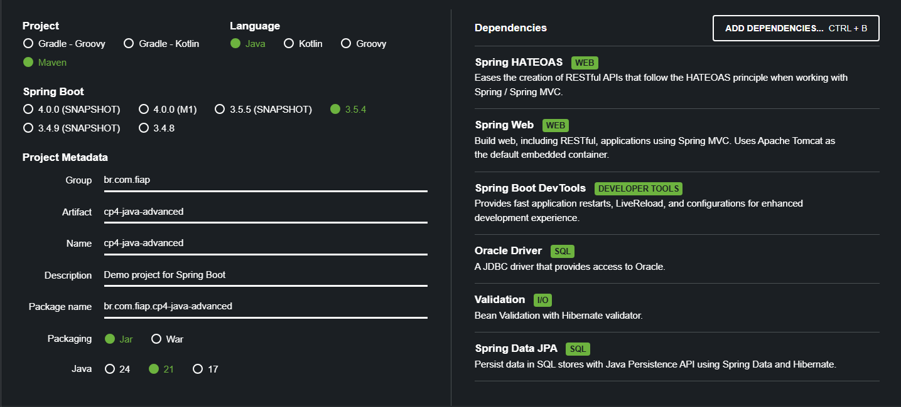

# 🛠️ API de Ferramentas

---

## 📑 Sumário

- [👥 Integrantes do Grupo](#-integrantes-do-grupo)
- [🛠️ Tecnologias Utilizadas](#-tecnologias-utilizadas)
- [📖 Descrição do Projeto](#-descrição-do-projeto)
- [📂 Estrutura do Projeto](#-estrutura-do-projeto)
- [⚙️ Configuração do Spring Initializr](#-configuração-do-spring-initializr)
- [🚀 Como Rodar a Aplicação](#-como-rodar-a-aplicação)
- [🧱 Estrutura da Entidade Ferramenta](#-estrutura-da-entidade-ferramenta)
- [📡 Endpoints da API](#-endpoints-da-api)
- [🌐 Deploy da API](#-deploy-da-api)

---

## 👥 Integrantes do Grupo
- 👨‍💻 **Felipe Ulson Sora** – RM555462 – [@felipesora](https://github.com/felipesora)
- 👨‍💻 **Augusto Lope Lyra** – RM558209 – [@lopeslyra10](https://github.com/lopeslyra10)
- 👨‍💻 **Vinicius Ribeiro Nery Costa** – RM559165 – [@ViniciusRibeiroNery](https://github.com/ViniciusRibeiroNery)

---

## 🛠️ Tecnologias Utilizadas
- Java 21
- Spring Boot 3.5.4
- Maven
- Banco de dados Oracle
- JPA (Hibernate)
- Validação com Jakarta Bean Validation
- RESTful APIs

---

## 📖 Descrição do Projeto

Este projeto é uma API simples de gerenciamento de ferramentas, desenvolvida para a **CP4 da disciplina de Java Advanced** na faculdade.  
Ela tem como objetivo permitir o cadastro, consulta, atualização e exclusão de ferramentas, facilitando o controle dos recursos disponíveis.  
O foco principal foi praticar conceitos de RESTful API, autenticação e manipulação de dados em banco Oracle utilizando Spring Boot.

---

## 📂 Estrutura do Projeto

```
src
└── main
└── java
└── com
└── seu_pacote
├── controller
├── dto
├── exception
├── mapper
├── model
├── repository
└── service
```

- 🕹️ **controller**: recebe e gerencia as requisições HTTP, fazendo a ponte entre o cliente e a lógica de negócio.
- 📦 **dto**: objetos de transferência de dados usados para enviar e receber informações da API, garantindo segurança e clareza.
- ⚠️ **exception**: classes para tratamento personalizado de erros e exceções da aplicação.
- 🗺️ **mapper**: responsável por converter objetos entre diferentes camadas, como DTOs e modelos (entities).
- 🧱 **model**: representa as entidades do banco de dados, definindo os atributos e relacionamentos.
- 🗃️ **repository**: interfaces que fazem a comunicação direta com o banco de dados usando JPA.
- 🔧 **service**: contém a lógica de negócio da aplicação, processando dados e regras antes de acessar o repositório ou retornar respostas.

---

## ⚙️ Configuração do Spring Initializr

Para iniciar o projeto, utilizamos o [Spring Initializr](https://start.spring.io/), configurando as dependências básicas necessárias para a API.  

Segue uma captura de tela (print) da configuração utilizada:



### Dependências selecionadas:
- Spring HATEOAS
- Spring Web
- Spring Boot DevTools (opcional para desenvolvimento)
- Oracle Driver
- Validation
- Spring Data JPA

---

## 🚀 Como Rodar a Aplicação

1. Clone este repositório:

```bash
   git clone https://github.com/felipesora/cp4-java-advanced.git
```
2. Configure o banco Oracle e atualize as credenciais no arquivo `application.properties` (ou `application.yml`).
3. Abra o projeto na sua IDE favorita (IntelliJ, Eclipse).
4. Execute a classe principal que inicializa o Spring Boot.
5. Use o Postman ou qualquer cliente HTTP para testar os endpoints.

---

# 🧱 Estrutura da Entidade Ferramenta

A classe `Ferramenta` representa a entidade principal do sistema, mapeada para a tabela `TDS_TB_Ferramentas` no banco de dados Oracle.

| Atributo        | Tipo           | Descrição                                            | Observações                                         |
|-----------------|----------------|------------------------------------------------------|-----------------------------------------------------|
| `id`            | Long           | Identificador único da ferramenta                    | Chave primária, gerada automaticamente (`IDENTITY`) |
| `nome`          | String         | Nome da ferramenta                                   | Obrigatório, máximo 100 caracteres                  |
| `tipo`          | String         | Tipo da ferramenta                                   | Obrigatório, máximo 70 caracteres                   |
| `classificacao` | String         | Classificação da ferramenta                          | Obrigatório, máximo 70 caracteres                   |
| `tamanho`       | Enum `Tamanho` | Tamanho da ferramenta (`PEQUENO`, `MEDIO`, `GRANDE`) | Armazenado como string, obrigatório                 |
| `preco`         | BigDecimal     | Preço da ferramenta                                  | Precisão 10,2 casas decimais                        |
| `quantidade`    | Integer        | Quantidade disponível                                | Obrigatório, até 10 dígitos                         |

---

# 📡 Endpoints da API

1. **📋 Listar todas as ferramentas**

- **Método:** `GET`
- **URL:** `/ferramentas`
- **Descrição:** Retorna a lista completa de ferramentas cadastradas.
- **Corpo da requisição:** *Nenhum*
- **Resposta:**
    - **Status:** 200 OK
    - **Corpo:** Array JSON com objetos FerramentaResponseDTO contendo os dados das ferramentas e links HATEOAS.
- **Erros possíveis:**
    - **500 Internal Server Error:** Problema no servidor ao recuperar as ferramentas.

---

2. **🔎 Buscar ferramenta por ID**

- **Método:** `GET`
- **URL:** `/ferramentas/{id}`
- **Descrição:**  Retorna uma ferramenta específica pelo seu ID.
- **Parâmetros:**
  - `id` (Long) — identificador da ferramenta
- **Corpo da requisição:** *Nenhum*
- **Resposta:**
    - **Status:** 200 OK
    - **Corpo:** Objeto JSON `FerramentaResponseDTO` com os dados da ferramenta e links HATEOAS.
- **Erros possíveis:**
  - **404 Not Found:** Ferramenta com o ID especificado não encontrada. 
  - **400 Bad Request:** ID inválido (ex: formato errado). 
  - **500 Internal Server Error:** Erro interno ao buscar a ferramenta.

---

3. **➕ Cadastrar nova ferramenta**

- **Método:** `POST`
- **URL:** `/ferramentas`
- **Descrição:**  Cria uma nova ferramenta com os dados fornecidos.
- **Corpo da requisição:**  JSON `FerramentaRequestDTO` com os dados da ferramenta (validados). Exemplo:
```json
{
  "nome": "Martelo",
  "tipo": "Manual",
  "classificacao": "Uso Profissional",
  "tamanho": "GRANDE",
  "preco": 79.90,
  "quantidade": 10
}
```
- **Resposta:**
    - **Status:** 201 Created
    - **Headers:** `Location` com URL da ferramenta criada
    - **Corpo:** Objeto JSON `FerramentaResponseDTO` com os dados da ferramenta criada e links HATEOAS.
- **Erros possíveis:**
    - **400 Bad Request:** Dados inválidos ou faltando campos obrigatórios.
    - **500 Internal Server Error:** Erro interno ao buscar a ferramenta.

---

4. **✏️ Atualizar ferramenta inteira**

- **Método:** `PUT`
- **URL:** `/ferramentas/{id}`
- **Descrição:**  Atualiza completamente os dados da ferramenta com o ID informado.
- **Parâmetros:**
  - `id` (Long) — identificador da ferramenta
- **Corpo da requisição:**  JSON `FerramentaRequestDTO` com os novos dados (validados).
```json
{
  "nome": "Martelo de Borracha",
  "tipo": "Manual",
  "classificacao": "Uso Profissional",
  "tamanho": "MEDIO",
  "preco": 59.9,
  "quantidade": 15
}
```
- **Resposta:**
    - **Status:** 200 OK
    - **Corpo:** Objeto JSON `FerramentaResponseDTO` com os dados atualizados e links HATEOAS.
- **Erros possíveis:**
    - **400 Bad Request:** Dados inválidos ou formato incorreto.
    - **404 Not Found:** Ferramenta com o ID especificado não encontrada.
    - **500 Internal Server Error:** Erro interno ao buscar a ferramenta.

---

5. **✂️ Atualização parcial da ferramenta**

- **Método:** `PATCH`
- **URL:** `/ferramentas/{id}`
- **Descrição:**  Atualiza parcialmente os dados da ferramenta com o ID informado.
- **Parâmetros:**
    - `id` (Long) — identificador da ferramenta
- **Corpo da requisição:**  JSON `FerramentaPatchDTO` com os campos que deseja atualizar. Exemplo:
```json
{
  "quantidade": 20
}
```
- **Resposta:**
    - **Status:** 200 OK
    - **Corpo:** Objeto JSON `FerramentaResponseDTO` com os dados atualizados e links HATEOAS.
- **Erros possíveis:**
    - **400 Bad Request:** Dados inválidos ou mal formatados.
    - **404 Not Found:** Ferramenta com o ID especificado não encontrada.
    - **500 Internal Server Error:** Erro interno ao buscar a ferramenta.

---

6. **🗑️ Deletar ferramenta**

- **Método:** `DELETE`
- **URL:** `/ferramentas/{id}`
- **Descrição:**  Remove a ferramenta com o ID especificado.
- **Parâmetros:**
    - `id` (Long) — identificador da ferramenta
- **Corpo da requisição:** *Nenhum*
- **Resposta:**
    - **Status:** 204 No Content
    - **Corpo:** *Nenhum*
- **Erros possíveis:**
    - **404 Not Found:** Ferramenta com o ID não encontrada.
    - **500 Internal Server Error:** Erro interno ao buscar a ferramenta.

---

## 🌐 Deploy da API

A API está publicada e disponível para acesso no Render.  
Confira o projeto funcionando no link abaixo:  

🔗 [Acessar API no Render](https://cp4-java-advanced.onrender.com/ferramentas)

>**Nota:** A URL base da API é `https://cp4-java-advanced.onrender.com`
Por exemplo, para listar as ferramentas, acesse:
`https://cp4-java-advanced.onrender.com/ferramentas`